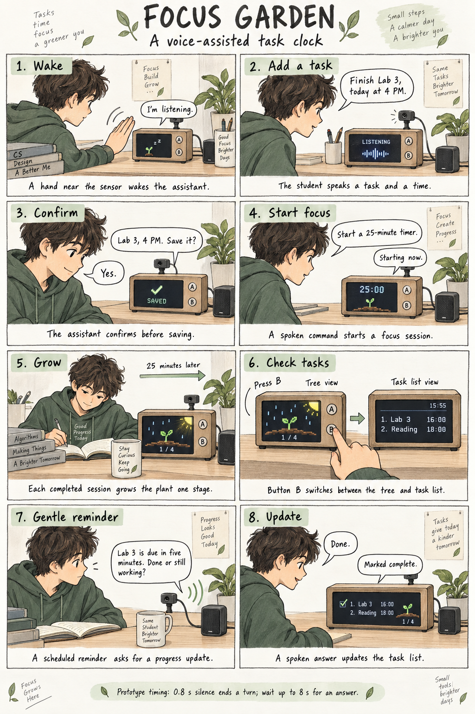

# Part D — Focus Garden: A Voice-Assisted Task Clock

## Concept

Focus Garden combines a voice-controlled task list with my pixel-art Pomodoro clock. The user can speak a task and its due time, confirm the entry, and start a 25-minute focus session. Gentle rain and warm light appear on the screen while the user studies, and four completed sessions grow a tree. Button B switches between the tree view and a simple clock-and-task view. Before a task is due, the device asks whether it is done or still in progress, and the user answers by voice.

This storyboard describes a proposed interaction, not a completed or user-tested prototype.

## Prototype scope

- Up to four tasks for today, with short English titles and explicit local due times.
- English speech for the first prototype, matching the English-only recognition models used in Parts B and C.
- One 25-minute focus timer at a time. Starting another timer while one is running requires confirmation.
- Four completed focus sessions grow a tree. Marking a task done does not itself add a growth stage.
- A reminder five minutes before a task is due. A response of “Done” marks it complete; “Still working” offers a ten-minute snooze.
- Tasks and focus progress are saved locally, so restarting the program does not erase the list.
- No calendar-account sync, recurring events, automatic deadline extraction from course websites, or open-ended conversation in this prototype.

## Screen and controls

The tree page retains the existing pixel-art plant, rain, warm on-screen light, countdown, and growth progress.
The task page uses a small time display at the top and up to four numbered task rows below it. Each row has a short title, due time, and completion mark. Long titles are shortened on screen; the full title remains stored and can be spoken back.

Button B changes pages. Button A or a hand near the existing APDS9960 proximity sensor opens a voice interaction. The hand gesture only wakes listening when the assistant is idle; repeated gestures do not restart a running timer. The existing sensor detects proximity rather than physical touch. In the proposed redesign, starting a focus session becomes a voice command.

## Storyboard captions

1. A hand near the sensor wakes the assistant.
2. The student speaks a task and a time.
3. The assistant confirms before saving.
4. A spoken command starts a focus session.
5. Each completed session grows the plant one stage.
6. Button B switches between the tree and task list.
7. A scheduled reminder asks for a progress update.
8. A spoken answer updates the task list.

## Imagined dialogue and timing

The example assumes an existing Reading task due at 6 PM. The student adds Lab 3, starts focusing at approximately 3:25 PM, completes one session at 3:50 PM, and receives the reminder at 3:55 PM.

| Moment | Speaker | Dialogue / action | Wait and visible feedback |
|---|---|---|---|
| Wake | User | Moves a hand near the sensor. | Screen gently fades in; normal clock animation continues independently. |
| Listen | Device | “I'm listening.” | After playback finishes, show LISTENING and wait up to 8 seconds for speech to begin. |
| Add | User | “Finish Lab 3, today at four PM.” | After 0.8 seconds of silence, show THINKING while transcription runs. |
| Confirm | Device | “Finish Lab 3, today at four PM. Save it?” | After playback, wait up to 8 seconds for the user to begin replying. |
| Save | User / Device | “Yes.” / “Saved.” | Commit the task only after confirmation; return to the task page. |
| Focus | User | Wakes listening again and says, “Start a 25-minute timer.” | End the turn after 0.8 seconds of silence. |
| Start | Device | “Starting now.” | Show 25:00, then begin the countdown and rain animation. |
| Study | User | Studies for 25 minutes. | The device stays quiet during this session. One completed session adds one growth stage. |
| View | User | Presses B to see the clock and task list. | Page changes; the timer state is preserved. |
| Reminder | Device | “Lab 3 is due in five minutes. Done or still working?” | After speaking, show LISTENING and wait up to 8 seconds for a reply to begin. |
| Complete | User / Device | “Done.” / “Marked complete.” | Mark Lab 3 complete. Keep the tree at the earned growth stage. |

The 0.8-second endpointing threshold is a starting hypothesis to evaluate using Part C. It is not the total response delay: transcription and synthesis add processing time. The 8-second limit concerns waiting for speech to start; it should not cut off a reply already in progress. A maximum utterance duration of 20 seconds keeps this short-command prototype bounded.

## Alternate paths to act out

- **Wrong recognition:** User says “No” at confirmation. Device says, “Let's try again. What is the task and time?” Nothing is saved until confirmed.
- **Unclear time:** User says “Finish Lab 3 later.” Device asks, “What time today? Please include AM or PM.”
- **Still working:** Device asks, “Remind you again in ten minutes?” User says “Yes.” The reminder is snoozed; the original deadline stays unchanged.
- **No answer:** After 8 seconds without speech, the device returns to its normal page and leaves the task unchanged. It does not assume completion or repeatedly speak.
- **Reminder during focus:** Show a small reminder indicator and queue the spoken question until the session ends, so the assistant does not interrupt focused work. This means the audible reminder can be later than five minutes before the deadline.
- **List full:** Device says, “Today's list is full. Please remove a task first.”

## Design process

The starting idea was a voice-based calendar and personal secretary. I narrowed it to today's tasks, one focus timer, and short progress updates so the interaction can be prototyped on the Pi. I kept the tree page from my previous clock and reduced the clock's size on the second page to make room for tasks. I added spoken confirmation because recognizing a task title or time incorrectly could otherwise create the wrong reminder. The storyboard and dialogue are initial design proposals; observations from acting them out will guide the next revision.

## Part E testing plan — not completed yet

Ask at least two other people to try the interaction, without showing them the dialogue script beforehand. Act as the device, speak its prompts, and record the interaction with participants' agreement. Give each person the goal of adding a task, starting a focus session, and responding to a reminder. Simulate the passage of 25 minutes for the role-play and label the simulation clearly.

Observe how people naturally phrase task names and times, whether they wait for LISTENING, whether 0.8 seconds feels too short, and how they respond to the reminder. Record what differed from this imagined dialogue. Do not fill in findings until these interactions have happened.

## Illustration credit

Storyboard concept developed from my proposed clock interaction; illustration generated with AI assistance using an image generation tool.
