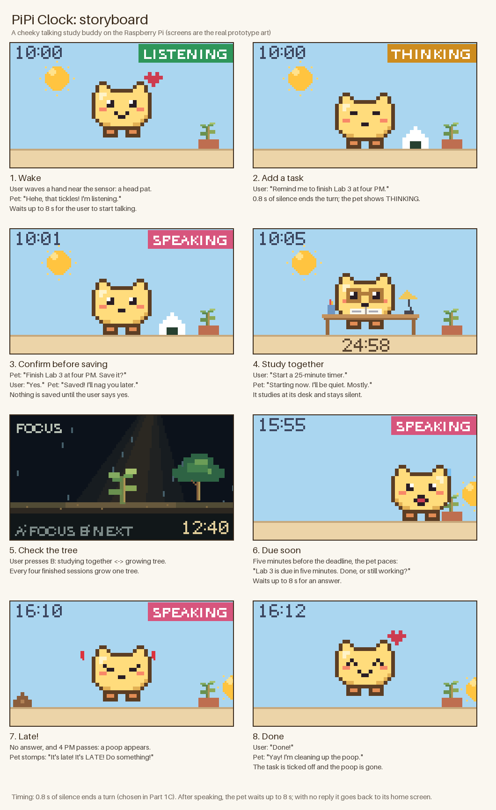
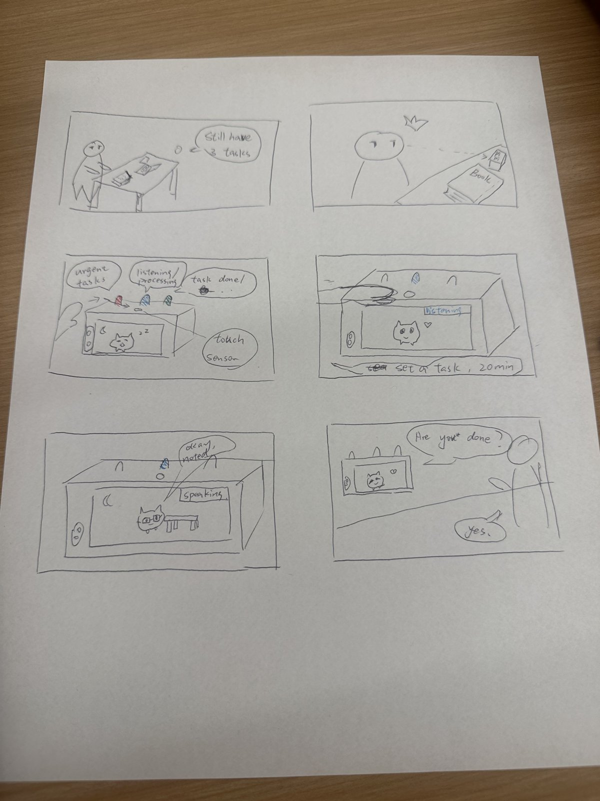
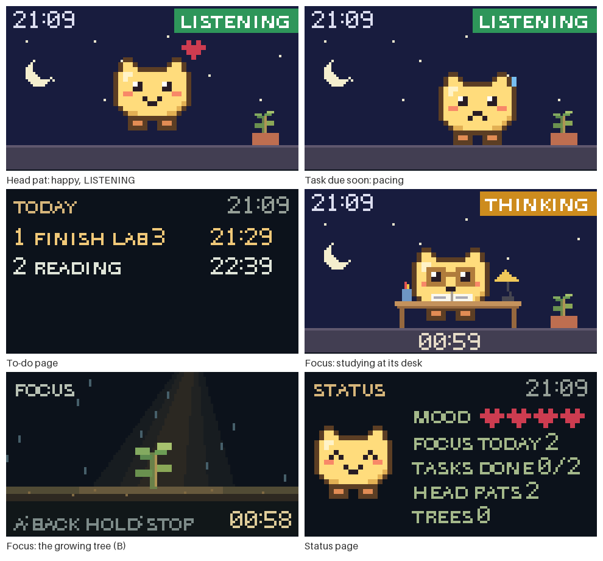
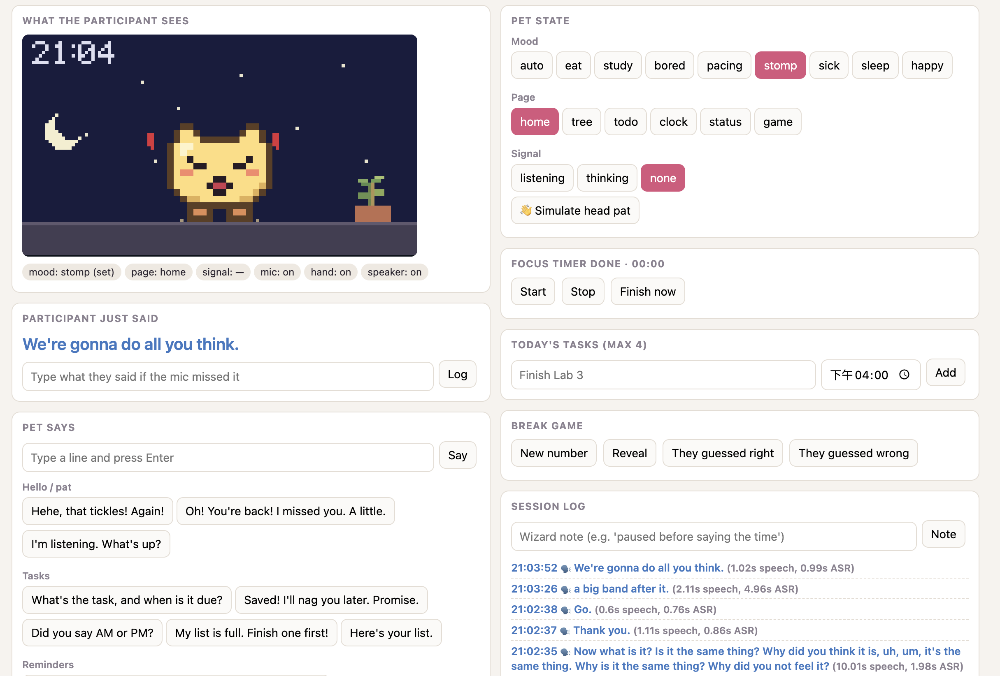
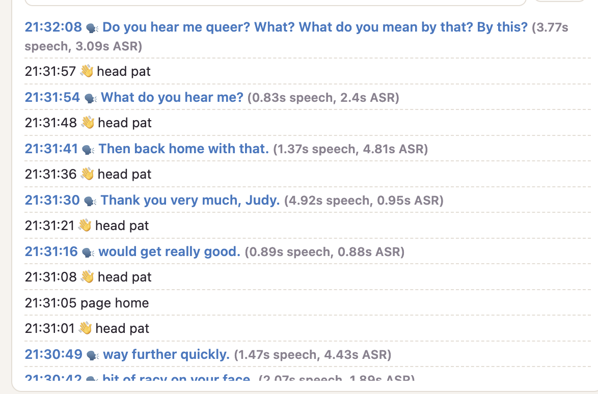

# Chatterboxes

**NAMES OF COLLABORATORS HERE**
Simin Xu (sx333)

<details>
<summary>Instructions</summary>

(https://youtu.be/LZ0VJClIlRI?si=Yy84mcyVYuVV19mn)

In this lab, we want you to design interaction with a speech-enabled device — something that listens and talks to you. This device can do anything *but* control lights (since we already did that in Lab 1). First, we want you to storyboard what you imagine the conversational interaction to be like. Then you will use wizarding techniques to elicit examples of what people might say, ask, or respond. We then want you to use the examples collected from at least two other people to inform the redesign of the device.

We will focus on **audio** as the main modality for interaction to start; these general techniques can be extended to **video**, **haptics** or other interactive mechanisms in the second part of the Lab.

A note on what you are building with. Speech interfaces are usually taught as two boxes — speech-in, speech-out — and that framing hides the part that actually determines whether an interaction works. Between listening and speaking sits the question of **whose turn it is**: when does the device decide you have finished talking, and how long does it make you wait before it answers? This lab gives you direct control over both, and we will ask you to notice what changes when you move them.

## Prep for Part 1: Get the Latest Content and Pick up Additional Parts

Please check instructions in [prep.md](prep.md) and complete the setup.

### Pick up Web Camera If You Don't Have One

Students who have not already received a web camera will receive their Webcam and at the beginning of lab. If you cannot make it to class this week, please contact the TAs to ensure you get these.

### Get the Latest Content

As always, pull updates from the class Interactive-Lab-Hub to both your Pi and your own GitHub repo.

**\[recommended\]** Option 1: On the Pi, `cd` to your `Interactive-Lab-Hub`, pull the updates from upstream (class lab-hub) and push the updates back to your own GitHub repo. You will need the *personal access token* for this.

```
pi@ixe00:~$ cd Interactive-Lab-Hub
pi@ixe00:~/Interactive-Lab-Hub $ git pull upstream Fall2026
pi@ixe00:~/Interactive-Lab-Hub $ git add .
pi@ixe00:~/Interactive-Lab-Hub $ git commit -m "get lab3 updates"
pi@ixe00:~/Interactive-Lab-Hub $ git push
```

Option 2: On your own GitHub repo, create a pull request to get updates from the class Interactive-Lab-Hub. After you have the latest updates online, go to your Pi, `cd` to your `Interactive-Lab-Hub` and use `git pull`.

</details>

---

# Part 1

<details>
<summary>Instructions</summary>

## Setup

Create and activate a virtual environment for this lab:

```
pi@ixe00:~$ cd Interactive-Lab-Hub/Lab\ 3
pi@ixe00:~/Interactive-Lab-Hub/Lab 3 $ python3 -m venv .venv
pi@ixe00:~/Interactive-Lab-Hub/Lab 3 $ source .venv/bin/activate
(.venv) pi@ixe00:~/Interactive-Lab-Hub/Lab 3 $
```

Install the Python dependencies:

```
(.venv) $ pip install -r requirements.txt
```

This takes a few minutes. If you would like it to take considerably less time, [`uv`](https://docs.astral.sh/uv/) is a drop-in replacement for `pip` that is dramatically faster on the Pi:

```
(.venv) $ pip install uv && uv pip install -r requirements.txt
```

Then run the setup script, which installs the classic speech synthesizers, downloads the voice activity detection model, and pre-fetches a neural voice and a speech recognition model so you are not waiting on downloads during lab:

```
(.venv):~$ cd speech-scripts
(.venv) $ ./setup.sh
```

Check your audio devices before going further. `arecord -l` lists capture devices and `aplay -l` lists playback devices; if your webcam microphone or Bluetooth speaker does not appear, fix that first — every script below assumes the system defaults are the ones you want.

</details>

## A. Text to Speech

<details>
<summary>Instructions</summary>

Your Pi can speak in several quite different ways, and the differences are audible in a way that matters for design. In `speech-scripts/` there are shell scripts for each.

### The classic engines

```
(.venv) $ cd speech-scripts

(.venv) $ sudo apt update
(.venv) $ sudo apt install -y espeak festival festvox-kallpc16k

(.venv) $ ./espeak_demo.sh
(.venv) $ ./festival_demo.sh
```

You can run these `.sh` files by typing `./filename`, and read one with `cat filename`. You can also play audio files directly with `aplay filename` — try `aplay lookdave.wav`.

These are all decades-old technology and they sound like it. `espeak-ng` is a *formant synthesizer*: it generates speech from an acoustic model of the vocal tract, which is why it sounds robotic but also why the whole thing fits in a couple of megabytes and responds instantly. `festival` is *concatenative*: they stitch together recorded fragments of a real speaker, which sounds more human but breaks audibly at the seams.

### Neural TTS with Piper

Note that the Piper command line changed in version 1.x — voices are now downloaded explicitly with `python3 -m piper.download_voices`, and you invoke it as `python3 -m piper`. Tutorials you find online may show the old `echo ... | piper --model ...` form, which no longer works. Browse the [voice samples](https://rhasspy.github.io/piper-samples) and download a different one if you'd like:

```
(.venv) $ python3 -m piper.download_voices en_US-lessac-medium
```

[Piper](https://github.com/OHF-Voice/piper1-gpl) synthesizes speech with a small neural network, runs comfortably on the Pi 5, and sounds markedly better than the above.

```
(.venv) $ ./piper_demo.sh
```

The demo script also shows `--output-raw`, which streams audio to the speaker as it is generated rather than writing a file first. Listen for the difference in how quickly speech begins. In a conversational system this gap is the thing your user experiences as responsiveness.

</details>

\*\***Write your own shell file to use your favorite of these TTS engines to have your Pi greet you by name.**\*\*

(This shell file should be saved to your own repo for this lab.)

My shell file is [`greet_simone.sh`](greet_simone.sh). Following `piper_demo.sh`, it uses Piper, my favorite of the three engines, to say "Hi Simone, Hi Simone":

```
(.venv) $ ./greet_simone.sh
```

\*\***Then answer: Is the same greeting, in these different voices, the same greeting? Describe one concrete way the voice changed what the utterance seemed to mean or who seemed to be speaking.**\*\*

I ran `./espeak_demo.sh`, `./festival_demo.sh`, `aplay lookdave.wav` and `./piper_demo.sh`, and also heard all three engines say the same greeting, "Hi Simone, Hi Simone".

- **Best:** Piper. It was both the most natural and the friendliest.
- **eSpeak** was the most mechanical; it sounded like a robot.
- **Festival**'s male voice sat somewhere between natural and unnatural.
- **Same greeting, different speaker:** the words were identical, but with eSpeak "Hi Simone" sounded like a robot saying my name, while Piper's female voice sounded like Siri greeting me.
- **Streaming:** with `--output-raw` in `piper_demo.sh`, Piper seemed to start speaking faster than when it first wrote a file.

## B. Speech to Text

<details>
<summary>Instructions</summary>

We use [faster-whisper](https://github.com/SYSTRAN/faster-whisper), a reimplementation of OpenAI's Whisper model that runs several times faster on CPU and does not require PyTorch. All processing happens on the Pi; nothing is sent to a server.

```
(.venv) $ python transcribe.py lookdave.wav
```

The transcript is not the interesting output here — the timings are. Run it again with a larger model and compare:

```
(.venv) $ python transcribe.py lookdave.wav --model base.en
(.venv) $ python transcribe.py lookdave.wav --model small.en
#  noted that the first run may take longer because the model is downloaded, and that the HF unauthenticated-request warning is expected and not an error.
```

Available sizes, smallest first: `tiny.en`, `base.en`, `small.en`, `medium.en`. The `.en` variants are English-only and faster than their multilingual counterparts at the same size.

</details>

\*\***Record a few seconds of your own speech (`arecord -d 5 -f cd -c 1 -r 16000 test.wav`) and transcribe it with at least two model sizes. Report the real-time factor for each. At what point does the accuracy improvement stop being worth the delay, for a system that has to answer you?**\*\*

I followed the course steps in `speech-scripts/`, on the Pi:

```bash
python transcribe.py lookdave.wav                  # default tiny.en
python transcribe.py lookdave.wav --model base.en
python transcribe.py lookdave.wav --model small.en
arecord -d 5 -f cd -c 1 -r 16000 test.wav          # my own speech
python transcribe.py test.wav --model base.en
python transcribe.py test.wav --model small.en
```

`transcribe.py` runs faster-whisper on the CPU (`int8`, beam size 1). **RTF = transcription time ÷ audio duration**; model loading is reported separately and not included.

| Audio | Model | Transcript | Transcription time | RTF |
|---|---|---|---|---|
| lookdave.wav (3.72 s) | tiny.en | Look Dave, I can see you're really upset about this. | 1.02 s | 0.28x |
| lookdave.wav (3.72 s) | base.en | Look Dave, I can see you're really upset about this. | 2.13 s | 0.57x |
| lookdave.wav (3.72 s) | small.en | Look Dave, I can see you're really upset about this. | 6.05 s | 1.62x |
| My recording (5.00 s) | base.en | Hi, how's it going? | 1.97 s | 0.39x |
| My recording (5.00 s) | small.en | Hi, how's it going? | 5.45 s | 1.09x |

- **What I actually said:** "Hi, how's going" (without "it").
- **Errors:** both models added the word "it", turning what I said into the more common phrase "how's it going". `small.en` made exactly the same mistake as `base.en`, so it was no more accurate here.
- **Is the accuracy worth the delay?** `base.en` is good enough. `small.en` is too slow to be worth it: it took about 2.5 to 3 times as long, and its RTF was above 1, meaning it needed longer than the audio itself. For a system that has to answer me, I think recognition should be at least 80% accurate.

\*\***Write your own script that verbally asks for a numerical input (a phone number, zipcode, number of pets) and records the answer the respondent provides.**\*\* Numbers are a good stress test — transcription systems make characteristic errors on digit strings, and you will want to know what they are before you design around them.

My script is [`ask_pets.sh`](ask_pets.sh). It uses the same course tools as above:

1. Piper asks aloud: "How many pets do you have? Please answer with a number."
2. `arecord` records the answer for 5 seconds (`pets_answer.wav`, not committed).
3. `transcribe.py` with `base.en` transcribes it and saves the output to `pets_answer.txt`.

| What I said | Transcript | Transcription time | RTF | Correct? |
|---|---|---|---|---|
| one | One | 1.63 s | 0.33x | Yes |

The number came back as the word "One", not the digit "1".

## C. Turn-taking: knowing when someone has stopped talking

<details>
<summary>Instructions</summary>

Everything so far has worked on fixed audio files. A real conversational device does not get told when to start and stop recording — it has to decide. This is the problem that makes speech interfaces hard, and it is mostly not a speech recognition problem.

We use a **voice activity detector** (VAD) to segment the microphone stream into utterances. `listen.py` runs Silero VAD continuously and hands each detected utterance to faster-whisper:

```
(.venv) $ cd speech-scripts
(.venv) $ python listen.py
```

Speak, pause, and watch it transcribe. Now change the endpointing threshold — the amount of silence the system requires before it decides your turn is over:

```
(.venv) $ python listen.py --min-silence 0.2
(.venv) $ python listen.py --min-silence 1.5
```

</details>

\*\***Try both extremes, and something in between. Describe what each one feels like to talk to. Note specifically: at 0.2s, what kinds of normal speech get cut off? At 1.5s, what does the delay make the system seem like?**\*\*

I ran the course `listen.py` in `speech-scripts/` with the default and three other endpointing thresholds, speaking several sentences with natural pauses each time:

```bash
python listen.py                      # default: 0.4 s
python listen.py --min-silence 0.2
python listen.py --min-silence 1.5
python listen.py --min-silence 0.8    # in between
```

| Threshold | What happened (examples from the transcript log) | How it felt |
|---|---|---|
| 0.4 s (default) | Sometimes split a sentence: after "It's a wonderful day. I love Giato." the pieces "a wonderful day." and "I love Jilato." came out as separate turns. Most turns took about 1 s to transcribe, but two took 4.7 s and 5.0 s. | Not very accurate; it occasionally cut sentences apart, and some sentences were slow. |
| 0.2 s | Saying "hi" on its own (0.5–0.7 s turns) was transcribed as "Bye" every time. "Hi, can you hear me?" became "Hi, I can you hear me.": the drawn-out "i" in "hi" was heard as a separate "I". | It kept mishearing me: "hi" became "bye", and one continuous sound was split into two syllables. |
| 1.5 s | No sentence was cut in the middle; 5.4 s and 5.5 s sentences arrived as one turn each. | I had to wait a second or two, but recognition was more accurate and it never cut in while I was still making my point. The wait made the system feel a bit dumb, like Siri back in the iPhone 4S days. |
| 0.8 s | Long sentences (6.5 s and 10 s) stayed whole; "Hi, hi, hi, can you hear me?" was transcribed correctly. Most turns took about 1 s. | Very natural: I didn't have to wait long, and it still started transcribing at the right moment after I paused. |

**Which threshold suits my project?** 0.8 s felt the most suitable for my device.

<details>
<summary>Instructions</summary>

There is no correct value. A system that takes drink orders and a system that listens to someone think out loud want very different thresholds, and the right one depends on what your users are doing with their pauses.

</details>

### The complete loop

<details>
<summary>Instructions</summary>

`echo_bot.py` puts the pieces together: it listens, endpoints, transcribes, and speaks a reply through Piper. The dialogue policy is deliberately trivial — it repeats what you said — so that everything you notice is a property of the timing rather than the content.

```
(.venv) $ python echo_bot.py
```

</details>

I ran the course `echo_bot.py` with its default settings (`python echo_bot.py`):

1. The Pi says "I'm listening." with Piper.
2. I say one sentence.
3. The VAD decides when I have finished (0.4 s of silence).
4. Whisper (`tiny.en`) transcribes it.
5. Piper repeats it back and the program exits.

| I said | Heard | Reply | Recognition | Piper's first audio | Total gap |
|---|---|---|---|---|---|
| "pretty good" | pretty good. | "You said: pretty good." | 0.86 s | 0.18 s | 1.04 s |

It repeated me correctly. I waited about a second or two for the reply, which felt fairly natural.

## D. Storyboard

<details>
<summary>Instructions</summary>

Storyboard and/or use a Verplank diagram to design a speech-enabled device. (Stuck? Make a device that talks for dogs. If that is too stupid, find an application that is better than that.)

</details>

\*\***Post your storyboard and diagram here.**\*\*

**PiPi Clock: a cheeky talking study buddy**



*The screens in this storyboard are pixel-art mockups rendered from my prototype code. A prompt for an illustrated version with the student in the scene is in [`pet_storyboard_prompt.txt`](pet_storyboard_prompt.txt).*


**Concept.** Something that normally cannot talk, a desk clock, becomes a small pet that can. The home screen is a yellow Tamagotchi-style pixel pet with a cheeky, cute personality instead of a plain reminder list.

- By voice (or button B) it opens other pages: the focus tree, today's to-do list (up to four short tasks), the clock, and a status page.
- It reacts to what I am doing: it snacks when nothing is happening, studies at its desk with glasses on during a focus session, gets bored when I idle, paces when a task is due within 30 minutes, stomps when a task is overdue, gets sick when two are overdue, and sleeps when told "Good night".
- During a focus session, B switches between two screens: the pet studying with me (a three-frame loop: reading, writing, turning a page) and the growing tree. Every four finished sessions grow one tree.
- A hand near the proximity sensor is a head pat: the pet jumps happily and starts listening.
- Overdue tasks appear as little poops on the floor; finishing or postponing the task cleans them up.
- The sky follows the real time of day: the sun rises on the left and sets on the right along one big circle beyond the screen, then the moon follows it through the night.
- Screen badges show when it is **LISTENING**, **THINKING** or **SPEAKING**.

<details>
<summary>Instructions</summary>

Write out what you imagine the dialogue to be. Use cards, post-its, or whatever method helps you develop alternatives or group responses.

</details>

\*\***Please describe and document your process.**\*\*

1. **First version: Focus Garden.** I started from a voice calendar and personal secretary, then narrowed it to a task clock built on my Lab 2 pixel tree: add today's tasks by voice, confirm them, start a 25-minute focus timer, and answer "Done" or "Still working" to reminders. The storyboard and full dialogue are in [PART_D_STORYBOARD.md](PART_D_STORYBOARD.md) ([image](focus_garden_storyboard.png)).
2. **Why I changed it.** After watching the course video, I felt the device should be like a real animal or a dog: something that normally cannot talk, now talking to you. A clock that only reads out a to-do list felt boring, so I gave it a personality: cheeky and cute.
3. **Tamagotchi-style pet.** The pet became the home screen, and the focus tree, to-do list and clock became pages it can open. It kept the hand sensor from Lab 2 as a head pat and got idle states such as sleeping, pacing, stomping and being sick. Overdue tasks became poops to clean up. I dropped an idea to use a light sensor.


<details>
<summary>Instructions</summary>

Your script should include the pauses. Where does your device wait, and for how long? You now know from Part C that this is a parameter you have to choose, not something that happens for free.

</details>

**Dialogue with pauses**

| # | Speaker | Line or action | Wait |
|---|---|---|---|
| 1 | User | Waves a hand near the sensor (a head pat). | — |
| | Pet | "Hehe, that tickles! I'm listening." | Waits **up to 8 s** for the user to start talking. |
| 2 | User | "Remind me to finish Lab 3 at four PM." | Turn ends after **0.8 s** of silence; the pet shows THINKING. |
| 3 | Pet | "Finish Lab 3 at four PM. Save it?" | Waits up to 8 s. |
| | User | "Yes." → Pet: "Saved! I'll nag you later." | Saved only after "yes". |
| 4 | User | "Start a 25-minute timer." | 0.8 s |
| | Pet | "Starting now. I'll be quiet. Mostly." | Silent for the whole session. |
| 5 | User | Presses B: studying together ↔ growing tree. | — |
| 6 | Pet | Paces: "Lab 3 is due in five minutes. Done, or still working?" | Waits up to 8 s. |
| 7 | — | No answer and 4 PM passes: a poop appears. Pet stomps: "It's late! It's LATE! Do something!" | — |
| 8 | User | "Done!" → Pet: "Yay! I'm cleaning up the poop." | The task is ticked off and the poop is gone. |

**Timing rules**

- **0.8 s** of silence ends the user's turn. In Part 1C this felt the most natural: 0.2 s broke words apart and 1.5 s felt slow.
- After the pet speaks, it waits **up to 8 s** for the user to start answering.
- With no answer, it goes back to its home screen and changes nothing.
- It always repeats a task and asks for confirmation before saving it.


## E. Acting out the dialogue

\*\***Describe if the dialogue seemed different than what you imagined when it was acted out, and how.**\*\*

https://youtu.be/SbAvVohB8aw

My friend had not seen the script. Even so, the acted-out dialogue went exactly like my script, so it did not seem different from what I imagined.

---

# Lab 3 Part 2

<details>
<summary>Instructions</summary>

For Part 2, you will redesign the interaction with the speech-enabled device using the data collected, as well as feedback from part 1.

</details>

## Prep for Part 2

1. What are concrete things that could use improvement in the design of your device? For example: wording, timing, anticipation of misunderstandings.

   The wording could sound more like a little pet and be cuter. The 0.8 s delay felt fine to me. Next I want to anticipate misunderstandings: users might get annoyed and say things like "You didn't understand me," so I will collect what upset users might say, recognize those phrases, and play a prepared reply asking them to move closer to the microphone because PiPi couldn't hear them clearly.

2. What are other modes of interaction *beyond speech* that you might also use to clarify how to interact? In particular: how does someone know when the device is listening, and when it is thinking? You have a screen and an LED.

   On top of the screen, my new design adds three LEDs. A red LED shows an urgent task, a blue LED shows that PiPi is listening or processing, and a green LED shows that a task is done. My reason is that the LEDs show the information users need to know most often, while thinking can be seen on the screen.

3. Make a new storyboard, diagram and/or script based on these reflections.

   This is my new storyboard and script:

   

4. (optional) Integrate [input devices](inputs.md) in the system

## Prototype your system

<details>
<summary>Instructions</summary>

The system should:
* use the Raspberry Pi
* use one or more sensors
* require participants to speak to it

</details>

*Document how the system works.*

PiPi Clock runs on the Raspberry Pi with the Mini PiTFT screen and its two buttons, the APDS-9960 proximity sensor, a USB speaker and the webcam microphone. Reaching toward the sensor pats PiPi: it jumps, shows LISTENING and listens. The microphone ends each turn after 0.8 s of silence, Whisper (tiny.en) transcribes it, and the text appears on my controller while the screen shows THINKING. As the wizard, I choose what PiPi says on a web controller on my laptop, and Piper speaks it on the Pi while the screen shows SPEAKING. The screen also changes on its own: PiPi snacks, studies at its desk during a focus session, paces when a task is due soon and stomps when one is overdue, and the sky follows the time of day. B switches pages, and A goes back to PiPi or starts a focus session.

*Include videos or screencaptures of both the system and the controller.*

Video of testing the prototype: https://youtube.com/shorts/w80BEt64n5s

Screens captured from the Pi:



The controller:



## Test the system

<details>
<summary>Instructions</summary>

Try to get at least two people to interact with your system. (Ideally, you would inform them that there is a wizard *after* the interaction, but we recognize that can be hard.)

Answer the following:

</details>

### What worked well about the system and what didn't?
Speech recognition was not very smooth. The screenshot below is from my speech recognition test, and most of the transcripts were wrong. The animation was smooth, and patting PiPi through the sensor to make it listen to us felt intuitive.



### What worked well about the controller and what didn't?
The controller is clear: I can see everything I need at a glance. What didn't work as well is that the transcript also picked up other people talking nearby, and some transcripts took several seconds to appear, so I couldn't always rely on it. Adding a task also means typing it in by hand while I listen.

### What lessons can you take away from the WoZ interactions for designing a more autonomous version of the system?
User interaction matters most. Claude can help me build my ideas, but I need to think carefully about which ways of interacting fit human intuition rather than AI logic. For example, my first button design, where A both started and stopped a focus session, felt confusing as soon as I used it, so I changed it to B for the next page and A for going back to PiPi. A more autonomous PiPi would also need more reliable speech recognition and a way to understand task names and times on its own, which I type in as the wizard now.

### How could you use your system to create a dataset of interaction? What other sensing modalities would make sense to capture?
My system already logs every head pat, every transcript (with its speech length and recognition time), every line PiPi says and every wizard action to a file for each session, and with participants' consent it can also save each utterance as audio. Pairing what people said with how the wizard answered gives a dataset for teaching a more autonomous PiPi what to say. The webcam's camera could also capture whether someone is at the desk and looking at PiPi, and the proximity sensor's raw readings could show how people reach toward it.

<details>
  <summary><strong>Submission Cleanup Reminder (Click to Expand)</strong></summary>

  **Before submitting your README.md:**
  - This readme.md file has a lot of extra text for guidance.
  - Remove all instructional text and example prompts from this file.
  - You may either delete these sections or use the toggle/hide feature in VS Code to collapse them for a cleaner look.
  - Your final submission should be neat, focused on your own work, and easy to read for grading.
</details>
